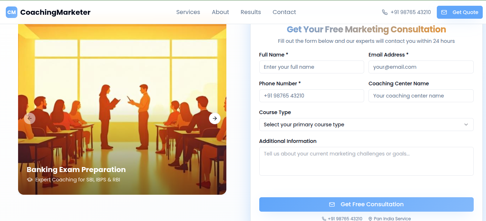
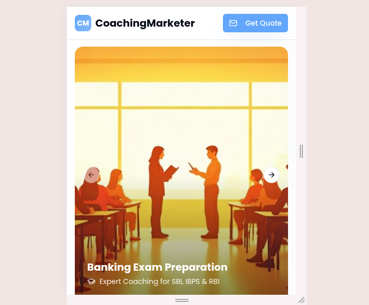

# 🚀 Marketing Landing Page

Welcome to **Mani Ram's** project – a modern and stylish marketing landing page built with cutting-edge tools like **Vite**, **React**, **TypeScript**, and **Tailwind CSS**.

🌐 **Live Demo**: [https://landing-page-in-reactjs.vercel.app/](https://landing-page-in-reactjs.vercel.app/)  
📁 **GitHub Repo**: [marketing-landing-page](https://github.com/Mani63000/marketing-landing-page.git)

---

## 📛 Badges


---

## ✨ Features

- ⚡ Lightning-fast performance with **Vite**
- 🎨 Clean and responsive UI with **Tailwind CSS**
- 💡 Built with **TypeScript** for safer code
- 🔥 Pre-styled components via **shadcn/ui**
- 💻 Works perfectly on all screen sizes (mobile-first)
- 📦 Easy to deploy and extend
- 🧑‍💻 Developer-friendly setup with minimal config

---

## 📸 Screenshots

> Add screenshots to showcase your landing page:

| Desktop View | Mobile View |
|--------------|-------------|
|  |  |

*(Add your actual screenshots to a `/screenshots` folder)*


### 🔹 2. Use Your Preferred IDE (Local Development)

Ensure you have Node.js and npm installed ([Install using nvm](https://github.com/nvm-sh/nvm#installing-and-updating)).

```bash
# Step 1: Clone the repository
git clone https://github.com/Mani63000/marketing-landing-page.git

# Step 2: Navigate into the project directory
cd marketing-landing-page

# Step 3: Install dependencies
npm install

# Step 4: Start the development server
npm run dev
